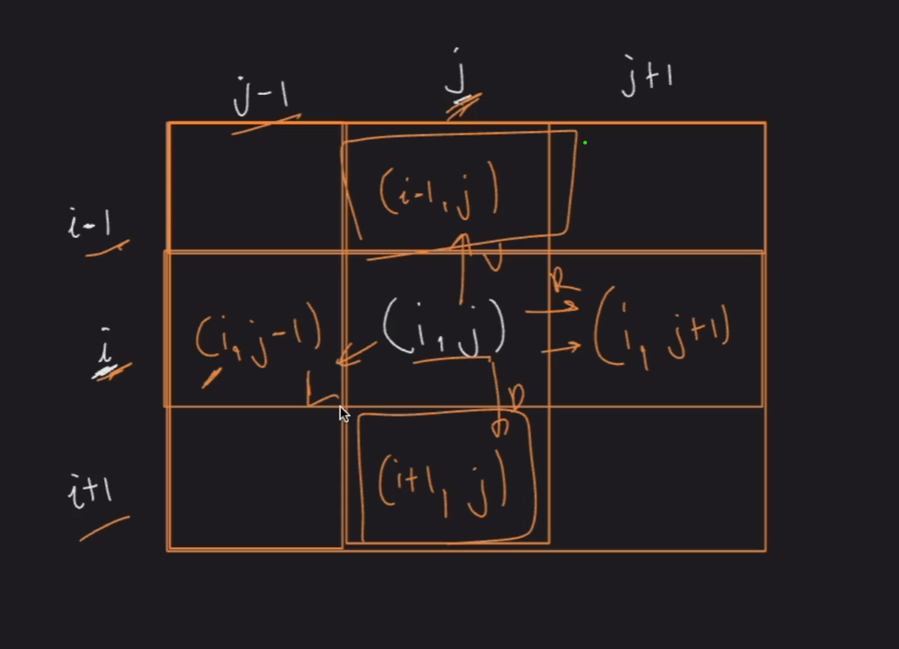
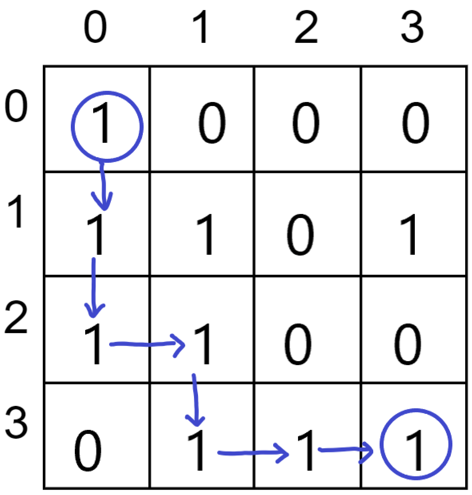
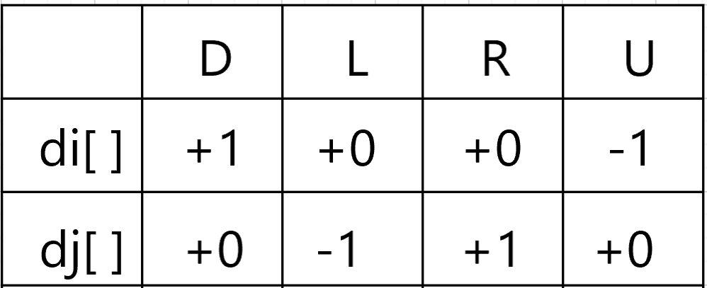
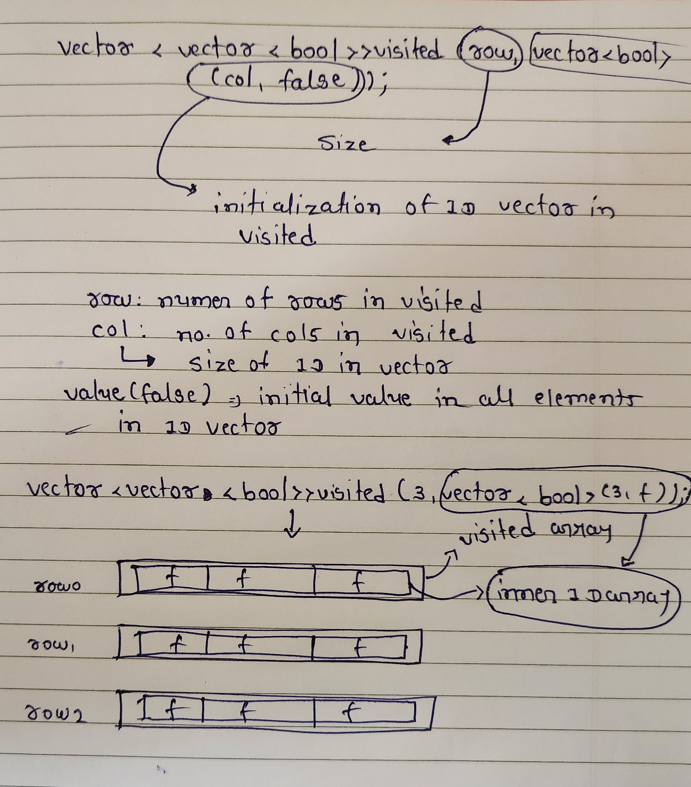
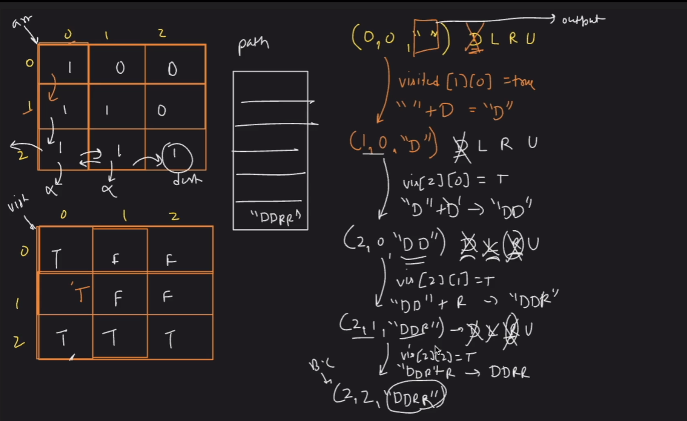

### Recursive Tree

#### For  “DDRDRR” :





#### Time Complexity: 
O(4^(m*n)), because on every cell we need to try 4 different directions.

#### Space Complexity:  
O(m*n), Maximum Depth of the recursion tree(auxiliary space).

### Approach:

Start at the source(0,0) with an empty string and try every possible path i.e upwards(U), downwards(D), leftwards(L) and rightwards(R).

As the answer should be in lexicographical order so it's better to try the directions in lexicographical order i.e (D,L,R,U)

Declare a 2D-array named visited because the question states that a single cell should be included only once in the path,so it's important to keep track of the visited cells in a particular path.

If a cell is in path, mark it in the visited array.

Also keep a check of the “out of bound” conditions while going in a particular direction in the matrix. 

Whenever you reach the destination(n,n) it's very important to get back as shown in the recursion tree.

While getting back, keep on unmarking the visited array for the respective direction.Also check whether there is a different path possible while getting back and if yes, then mark that cell in the visited array.


```cpp
#include <iostream>
#include <vector>
#include <string>

using namespace std;

class Solution {
private:
    void findPathHelper(int i, int j, vector<vector<int>>& a, int n, vector<string>& ans, string move, vector<vector<int>>& vis) {
        // Base case: if we reach the bottom-right cell, add the current move sequence to the answer
        if (i == n - 1 && j == n - 1) {
            ans.push_back(move);
            return;
        }

        // Mark the current cell as visited
        vis[i][j] = 1;

        // Move down
        if (i + 1 < n && !vis[i + 1][j] && a[i + 1][j] == 1) {
            findPathHelper(i + 1, j, a, n, ans, move + 'D', vis);
        }

        // Move left
        if (j - 1 >= 0 && !vis[i][j - 1] && a[i][j - 1] == 1) {
            findPathHelper(i, j - 1, a, n, ans, move + 'L', vis);
        }

        // Move right
        if (j + 1 < n && !vis[i][j + 1] && a[i][j + 1] == 1) {
            findPathHelper(i, j + 1, a, n, ans, move + 'R', vis);
        }

        // Move up
        if (i - 1 >= 0 && !vis[i - 1][j] && a[i - 1][j] == 1) {
            findPathHelper(i - 1, j, a, n, ans, move + 'U', vis);
        }

        // Backtrack: Unmark the current cell
        vis[i][j] = 0;
    }

public:
    vector<string> findPath(vector<vector<int>>& m, int n) {
        vector<string> ans;
        vector<vector<int>> vis(n, vector<int>(n, 0));

        // Start the path finding from the top-left corner if it's a valid starting point
        if (m[0][0] == 1) {
            findPathHelper(0, 0, m, n, ans, "", vis);
        }

        return ans;
    }
};

int main() {
    int n = 4;
    vector<vector<int>> m = {{1, 0, 0, 0}, {1, 1, 0, 1}, {1, 1, 0, 0}, {0, 1, 1, 1}};

    Solution obj;
    vector<string> result = obj.findPath(m, n);

    if (result.empty()) {
        cout << -1;
    } else {
        for (const string& path : result) {
            cout << path << " ";
        }
    }
    cout << endl;

    return 0;
}
```
### Code 2


```cpp
#include <iostream>
#include <vector>
#include <string>

using namespace std;

class Solution {
private:
    void solve(int i, int j, vector<vector<int>>& a, int n, vector<string>& ans, string move, vector<vector<int>>& vis, int di[], int dj[]) {
        if (i == n - 1 && j == n - 1) {
            ans.push_back(move);
            return;
        }
        string dir = "DLRU";
        for (int ind = 0; ind < 4; ++ind) {
            int nexti = i + di[ind];
            int nextj = j + dj[ind];
            if (nexti >= 0 && nextj >= 0 && nexti < n && nextj < n && !vis[nexti][nextj] && a[nexti][nextj] == 1) {
                vis[i][j] = 1;
                solve(nexti, nextj, a, n, ans, move + dir[ind], vis, di, dj);
                vis[i][j] = 0;
            }
        }
    }

public:
    vector<string> findPath(vector<vector<int>>& m, int n) {
        vector<string> ans;
        vector<vector<int>> vis(n, vector<int>(n, 0));
        int di[] = {1, 0, 0, -1};
        int dj[] = {0, -1, 1, 0};
        if (m[0][0] == 1) {
            solve(0, 0, m, n, ans, "", vis, di, dj);
        }
        return ans;
    }
};

int main() {
    int n = 4;
    vector<vector<int>> m = {
        {1, 0, 0, 0},
        {1, 1, 0, 1},
        {1, 1, 0, 0},
        {0, 1, 1, 1}
    };

    Solution obj;
    vector<string> result = obj.findPath(m, n);
    if (result.empty()) {
        cout << -1;
    } else {
        for (const string& path : result) {
            cout << path << " ";
        }
    }
    cout << endl;

    return 0;
}
```

### vector<vector<bool>> visited(row, vector<bool>(col, false));


### Explanation

1. **Purpose**: 
   - This line of code initializes a 2D vector named `visited` with dimensions `row x col`. 
   - Each element in this 2D vector is of type `bool` and is initially set to `false`.

2. **Syntax Breakdown**:
   - `vector<vector<bool>>`: This indicates that `visited` is a 2D vector (a vector of vectors) of type `bool`.
   - `visited(row, vector<bool>(col, false))`: This is the constructor for the 2D vector.
     - `row`: The number of rows in the 2D vector.
     - `vector<bool>(col, false)`: This creates a vector of `bool` with `col` elements, each initialized to `false`.

### Visual Representation

Let's assume `row = 3` and `col = 4`. The `visited` vector would look like this:

```
  Col0  Col1  Col2  Col3
Row0  false  false  false  false
Row1  false  false  false  false
Row2  false  false  false  false
```

### Step-by-Step Visualization

1. **Initialize a Single Row**:
   - `vector<bool>(col, false)` creates a single row vector with `col` elements, all set to `false`.
   ```
   [false, false, false, false]
   ```

2. **Create Multiple Rows**:
   - The outer vector constructor `visited(row, ...)` takes the single row vector and repeats it `row` times.
   - For `row = 3`:
   ```
   [
     [false, false, false, false], // Row 0
     [false, false, false, false], // Row 1
     [false, false, false, false]  // Row 2
   ]
   ```

### Code Execution Illustration

- **Step 1**: Initialize an empty vector `visited`.
  ```
  visited = []
  ```

- **Step 2**: Create a row with `col` `false` values.
  ```
  single_row = [false, false, false, false]
  ```

- **Step 3**: Repeat this row `row` times.
  ```
  visited = [
    [false, false, false, false], // Row 0
    [false, false, false, false], // Row 1
    [false, false, false, false]  // Row 2
  ]
  ```

### Summary
The line of code `vector<vector<bool>> visited(row, vector<bool>(col, false));` efficiently creates a 2D vector with `row` rows and `col` columns, where each element is a boolean initialized to `false`. This structure is often used to keep track of visited states in grid-based problems.


